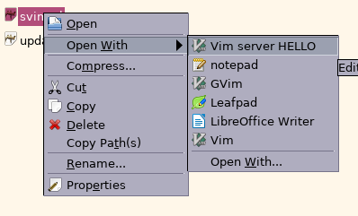

# svim

Wrapper for a vim server

## Dependecies

* perl

```
sudo apt-get install perl
```

## USAGE

svim.pl [options] [server name] [vim arguments]

### Options

* -t - Run vim server in a new terminal window

## aliases in .zshrc

```
alias svils='vim --serverlist'
alias svimls='svils'

alias svi='svim.pl'
alias svim='svi'
alias wsvi='svim -t'
alias wsvim='wsvi'

alias tsvi='tmux new-window svim.pl'
alias tvsvi='tmux split-window svim.pl'
alias thsvi='tmux split-window -h svim.pl'
alias tsvim='tsvi'
alias tvsvim='tvsvi'
alias thsvim='thsvi'
```

# update-desktop-vi-server.pl

Handling desktop files for vim servers



## USAGE

Add the following lines to your .vimrc:

```
if has("autocmd")
    autocmd VimEnter * silent! !update-desktop-vi-server.pl&
    autocmd VimLeave * !update-desktop-vi-server.pl 1
endif
```

